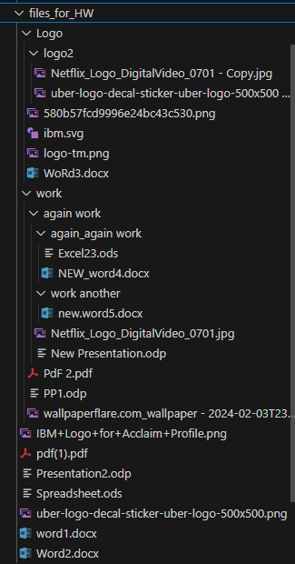
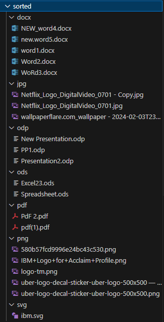
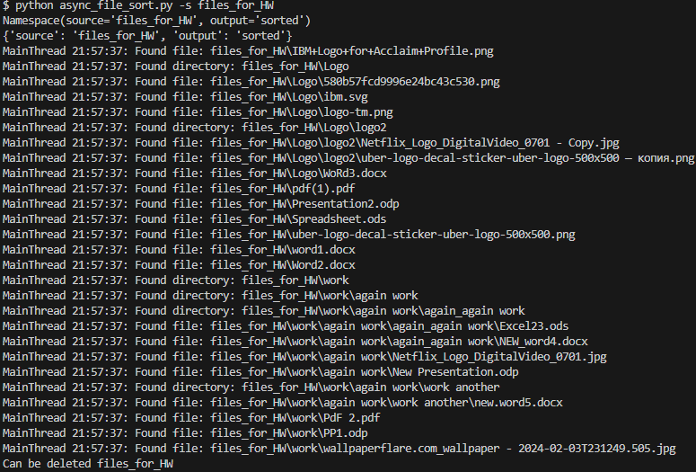
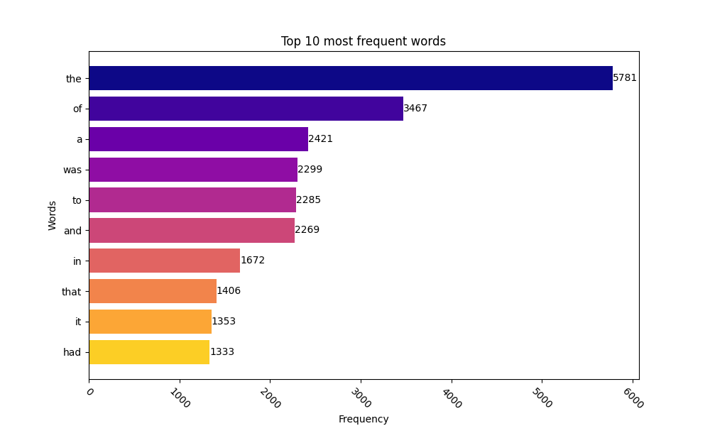

# SUMMARY

## Task 1. "async_file_sort.py"

A Python script that reads all the files in the user-specified source folder (source folder) and distributes them to subfolders in the destination directory (output folder) based on the file extension. The script performs sorting asynchronously for more efficient processing of large numbers of files.

 

## Task 2. "word_frequency.py"

A Python script that loads text from a given URL, analyzes the frequency of word usage in the text using the MapReduce paradigm, and visualizes the top words with the highest frequency of usage in the text.

*PS: The book used for the assignment was Nineteen Eighty-Four (1984) is written by George Orwell*

